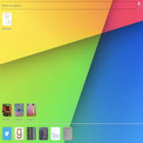

# corral-com-php
Docroot and images for http://corral.com 

This is a dump of the docroot for my website. Background tools are found in the <a href="https://github.com/ronnycorral/siteutils">siteutils</a> repository.

Things I need to to add to get everything:
<ul>
<li>js dirctory - There is some highcharts/highmaps content I need to clean up and document
<li>css directory - There is some jquery content I need to clean up and document
<li>clean up and replace swish - Since swish isn't around anymore I need to make sure I can recreate searching or replace it although this is probably part of <a href="https://github.com/ronnycorral/siteutils">siteutils</a>
<ul>
